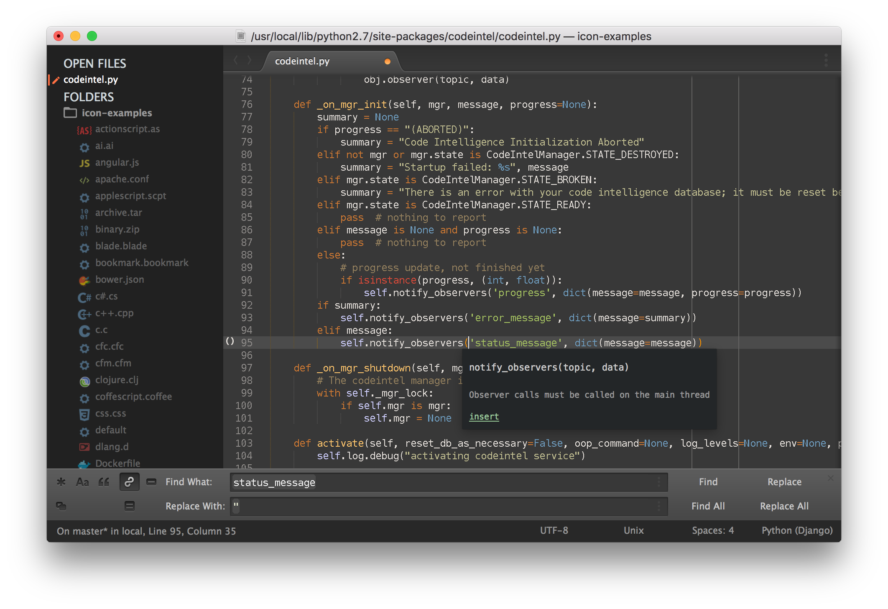
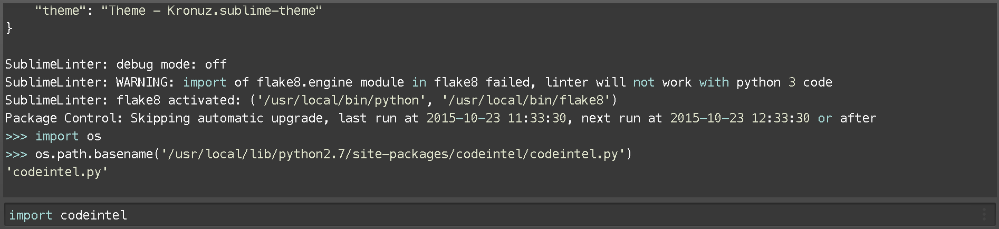

# Theme - OKronuz

Theme - OKronuz is a dark Theme for Sublime Text and also it is a syntax color scheme. The theme is based on [Kronuz](https://github.com/Kronuz/Kronuz-Theme).

## Design & Colors

[View a larger screenshot](https://raw.githubusercontent.com/OKronuz/OKronuz-Theme/master/Screenshots/OKronuz-Theme.png)




### Highlighted console




*The font used in the screenshots is Menlo 12 with no antialias.


## Installation

### Git Installation

Locate your Sublime Text `Packages directory` by using the menu item `Preferences -> Browse Packages...`.

Then, clone the repository using this command:

    git clone git@github.com:oakhan3/OKronuz-Theme.git "Theme - OKronuz"


## Activating the Theme

Activate this theme and color scheme by modifying your user preferences file, which you can find using the menu item `Sublime Text -> Preferences -> Settings - User`.

Then add the following code settings, depending on the theme you choose. **(After activating the theme, you must restart Sublime Text.)**

### Settings for Theme - OKronuz

```json
{
    "theme": "Theme - OKronuz.sublime-theme",
    "color_scheme": "Packages/Theme - OKronuz/OKronuz.tmTheme"
}
```

Other settings you can use:

`okronuz_theme_hide_fileicons` - If true, prevents the theme from showing file icons in the sidebar.
`okronuz_theme_no_folder_animation` - If true, prevents the theme from using folder icon animation in the sidebar.
`okronuz_theme_no_tree_indicator` - If true, prevents the theme from showing the currently selected item in the sidebar.

## Retina Resolution UI

OKronuz Theme supports retina display.
